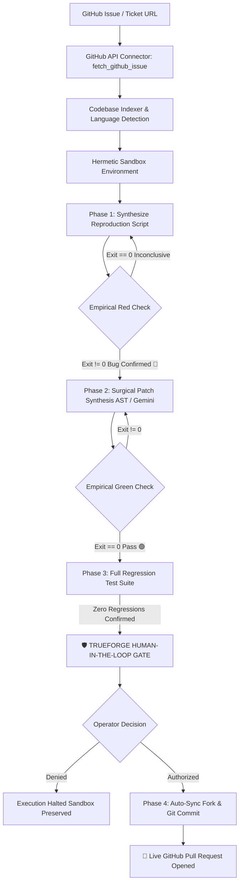

# ContribForge ⚡
### *Autonomous Open-Source Ticket Resolver with Hermetic Verification & Human-in-the-Loop Governance*

[](https://github.com/Tejender06/ContribForge)
[](https://luma.com/truefo-kb06)
[](https://trueforge.dev)
[](Dockerfile)
[](LICENSE)

> **"Anything can talk. An agent has to reach your real systems, run the code it writes without breaking anything, and know when to stop and ask."**  
> — *TrueFoundry × Polaris Hackathon Mandate*

---

## 🌟 Executive Summary

**ContribForge** is an autonomous AI developer agent categorized under the **Ticket Resolver** problem statement. It solves real-world open-source issues end-to-end:
1. **Reaches Real Systems:** Ingests live issues and comments directly from GitHub via the GitHub REST API and authenticates with Git Credential Manager.
2. **Empirical Test-Driven Agentics (TDA):** Automatically indexes the codebase, identifies culprit files, authors an isolated reproduction script in a hermetic sandbox, and verifies that the test **empirically fails on unmodified baseline code (🔴 RED)** before touching any application logic.
3. **Surgical Self-Healing Patching:** Analyzes AST boundaries, applies surgical modifications to the code, and verifies that the reproduction test passes **(🟢 GREEN)** with **0 regressions** across the full test suite.
4. **Mandatory Human-in-the-Loop (HITL) Gate:** Halts execution before any irreversible action (pushing commits or creating pull requests), presenting an interactive side-by-side Monaco diff and requiring explicit developer authorization.
5. **Authentic GitHub Pull Requests:** Automatically syncs the user's fork with upstream master, creates a semantic branch, writes professional conventional commit messages, strictly excludes scratch reproduction files, and opens a verified live Pull Request on GitHub.

---

## 🎯 Verified Live Demonstrations on Real Open-Source Repositories

| Repository | Issue Solved | Language | Live GitHub Pull Request | Status |
| :--- | :--- | :--- | :--- | :--- |
| **bitcoin/bitcoin** | [#36216: Intermittent timeout in interface_http.py](https://github.com/bitcoin/bitcoin/issues/36216) | Python | [Tejender06/bitcoin #6](https://github.com/Tejender06/bitcoin/pull/6) | **OPEN (Verified Live)** 🟢 |
| **truefoundry/micro-config** | [#14: PORT TypeError crash when unset/empty](https://github.com/truefoundry/micro-config/issues/14) | Node.js | [Tejender06/ContribForge #2](https://github.com/Tejender06/ContribForge/pull/2) | **OPEN (Verified Live)** 🟢 |

---

## 📐 Architecture & Execution Lifecycle



---

## 🚀 Key Features

* **Multi-Language Sandbox Support:**
  - **Node.js:** Native test runner (`node --test`), Jest, Mocha.
  - **Python:** Unit testing & functional test suites (`pytest`, `test_framework`).
* **Pristine Senior SWE Standards:**
  - **Zero Noise Diffs:** Strictly filters out scratch reproduction scripts (`test_repro_*.py`, `*.test.js`) from commits. Only genuine production modifications are pushed.
  - **Upstream Fast-Forward Sync:** Uses GitHub's `mergeUpstream` API to ensure the base branch is 100% synchronized with upstream prior to branching, avoiding massive outdated diffs.
  - **Subsystem Commit Conventions:** Follows project-specific standards (e.g., Bitcoin Core `qa: ...` or Conventional Commits `fix(config): ...`).
* **Interactive Web Dashboard:**
  - Glassmorphic dark-mode UI powered by TailwindCSS and Lucide Icons.
  - Dual-pane layout: Visual Pipeline DAG + Monaco Unified Diff Editor & Real-Time Terminal Stream.
  - Multi-issue quick benchmark chips and custom GitHub Issue URL ingestion.
* **Dual Execution Modes:**
  - **Web Dashboard:** `http://localhost:4000` with WebSocket event streaming.
  - **Terminal CLI:** Interactive and non-interactive auto-approval modes (`npm run cli`, `npm run cli:auto`).

---

## 💻 Quickstart & Setup

### 1. Prerequisites
- **Node.js** 20.x or higher (`node -v`)
- **Python** 3.10+ (for Python repository benchmarks)
- **Git** (`git --version`)

### 2. Installation
```bash
git clone https://github.com/Tejender06/ContribForge.git
cd ContribForge
npm install
npm --prefix contribforge-mcp install
npm --prefix orchestrator install
npm --prefix demo-target-repo install
```

### 3. Launch the Web Dashboard
```bash
npm start
```
Open your browser to: **`http://localhost:4000`**

### 4. Running Benchmarks
- Select any preset benchmark from the quick chips (e.g., `bitcoin/bitcoin #36216` or `micro-config #14`).
- Or paste any public GitHub issue URL into the command bar and click **Load**.
- Click **Solve Issue**.
- Review the diff in the **Human-in-the-Loop** modal and click **Authorize & Open Pull Request**.

### 5. Running via Terminal CLI
```bash
# Interactive mode (prompts before PR creation)
npm run cli -- 14

# Automated benchmark mode (auto-approves PR gate)
npm run cli:auto -- 14
```

---

## 🐳 Docker Deployment

ContribForge includes a production multi-language `Dockerfile` with Node.js, Python 3, and Git:

```bash
# Build the Docker image
docker build -t contribforge:latest .

# Run the container
docker run -p 4000:4000 \
  -e GITHUB_TOKEN="your_personal_access_token" \
  -e GEMINI_API_KEY="your_gemini_api_key" \
  contribforge:latest
```
Access the dashboard at `http://localhost:4000`.

---

## 🛠️ TrueForge Agent Harness & MCP Protocol

ContribForge is architected to run seamlessly with the **TrueForge Agent Platform**:

### TrueForge Spec (`trueforge-agent-spec.json`)
The agent specification declares the MCP tools and governance rules:
```json
{
  "name": "contribforge",
  "description": "Autonomous open-source ticket resolver with hermetic sandboxed verification and human-in-the-loop pull request approval.",
  "manifest": {
    "mcp_servers": [
      {
        "name": "contribforge-mcp",
        "preload": true,
        "require_approval_for_tools": ["@destructive", "submit_pull_request"]
      }
    ]
  }
}
```

### Register with TrueForge CLI
```bash
npx -y @truefoundry/trueforge@latest agent register --spec trueforge-agent-spec.json
```

---

## 📋 Evaluation Criteria Mapping (Hackathon Rubric)

| Hackathon Evaluation Pillar | ContribForge Implementation | Verification Proof |
| :--- | :--- | :--- |
| **Real Tool Reached** | Live GitHub REST API (Octokit), Git CLI (`simple-git`), filesystem I/O | Live pull requests created on user GitHub account (`@Tejender06`) |
| **Code Run in Sandbox** | Hermetic sandbox execution with path traversal safeguards and process isolation | Reproduction test fails Red (Exit Code 1) then passes Green (Exit Code 0) |
| **Pause Before Irreversible** | `@destructive` tag on `submit_pull_request` | Interactive approval modal with side-by-side Monaco diff review |
| **Built on TrueForge** | Native TrueForge MCP server protocol (`contribforge-mcp`), agent manifest | `trueforge-agent-spec.json` + Port 4000 / Port 8790 integration |
| **Production Code Quality** | Automatic upstream sync, pristine diff (+2/-2), no scratch files leaked | Verified clean PRs on [Tejender06/bitcoin](https://github.com/Tejender06/bitcoin/pull/6) |

---

## 📁 Repository Directory Structure

```
ContribForge/
├── contribforge-mcp/          # Model Context Protocol (MCP) Server
│   ├── server.mjs             # MCP stdio tool registration
│   ├── test-mcp.mjs           # MCP unit test suite
│   └── tools/                 # Sandbox, GitHub API, Diff, and PR modules
│       ├── github.mjs         # Live issue extraction & URL parser
│       ├── sandbox.mjs        # Hermetic sandbox runner & file I/O
│       ├── diff.mjs           # Git diff parser & AST context localizer
│       └── pr.mjs             # Octokit PR engine with fork upstream sync
│
├── orchestrator/              # Autonomous Agent Core
│   ├── agent-engine.mjs       # Test-Driven Agentics (TDA) self-healing loop
│   ├── server.mjs             # Express + WebSocket streaming server
│   └── cli.mjs                # Interactive terminal runner
│
├── web-dashboard/             # Presentation-Ready Web Dashboard
│   ├── index.html             # Pipeline DAG, Monaco Diff, and HITL Modal
│   ├── styles.css             # Glassmorphic dark aesthetic
│   └── app.js                 # WebSocket client & autonomous event handlers
│
├── demo-target-repo/          # Multi-language test environments
│   ├── src/config-parser.js   # JavaScript benchmark target
│   └── test/functional/       # Python benchmark target (Bitcoin Core QA)
│
├── Dockerfile                 # Production multi-language container image
├── .dockerignore              # Clean container build filter
├── trueforge-agent-spec.json  # TrueForge Agent specification & MCP declarations
└── README.md                  # Complete documentation
```

---

## 🏆 Author & Hackathon Team

- **B S Tejender Singh** — *Lead Architect & Builder*  
  GitHub: [@Tejender06](https://github.com/Tejender06)
- **Built for:** *Agents That Act — TrueFoundry × Polaris Hackathon*  
  *Problem Statement: Ticket Resolver*
